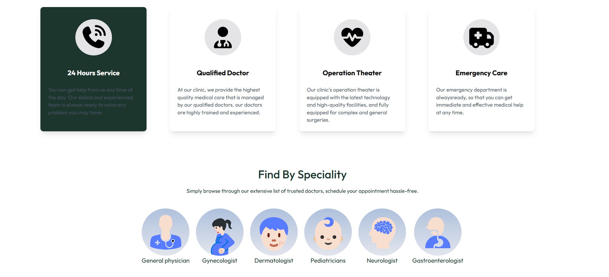
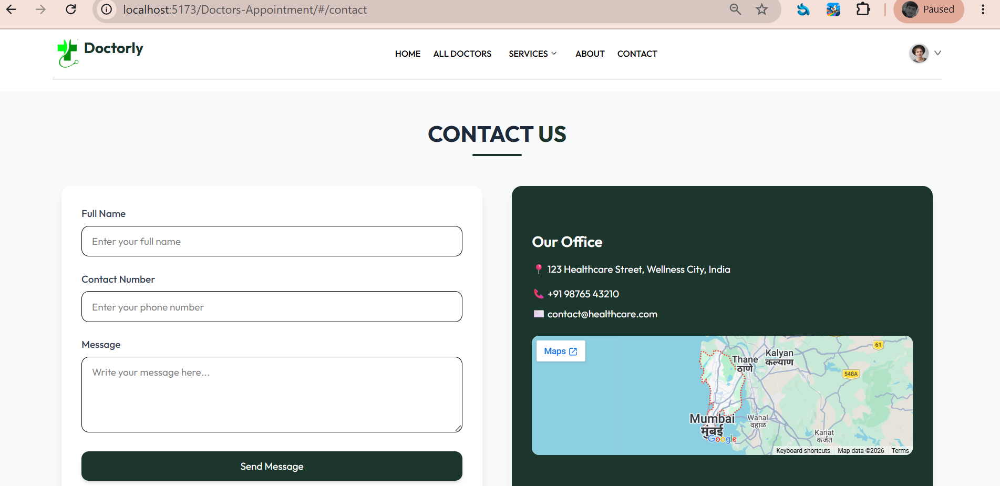
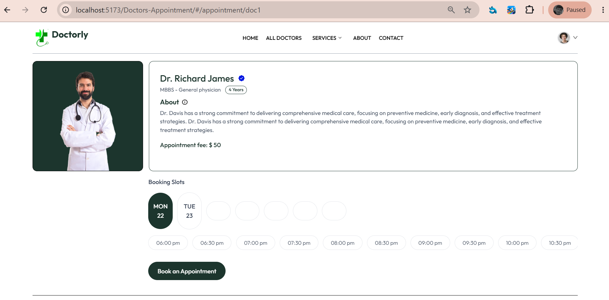
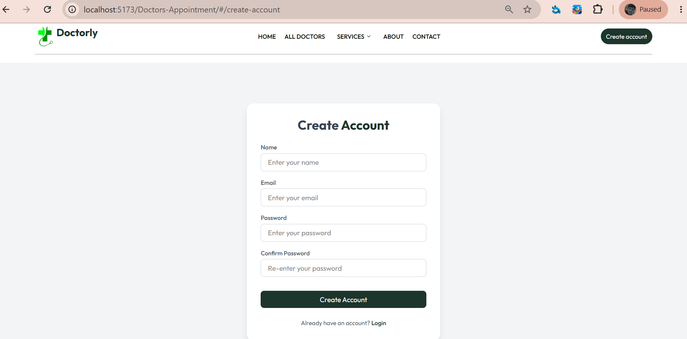

# Doctorly

Doctorly is a modern healthcare web application built using **React.js**, **React Router**, and **Tailwind CSS**. The platform allows patients to find doctors based on their specialization and book appointments, while doctors can register and manage their profiles.

## Features

- User Authentication (Login / Logout)
- Create New Account
- Doctor Registration
- Doctor Search by Specialization
- Appointment Booking
- Responsive Design
- React Router Based Navigation
- Modern UI with Tailwind CSS

## Technologies Used

- React.js
- React Router DOM
- Tailwind CSS
- JavaScript (ES6+)
- HTML5
- CSS3

## Available Specializations

- Gynecologist
- Orthologist
- General Physician
- Pediatrician
- Dermatologist
- And many more...

---

## Screenshots

### Home Page





---

### About Us Page


---

### Contact Page



---

### Doctor List Page


---

### Profile


---

### Doctor Details



---

### Create Account



---

### Login Page


---

## Installation

Clone the repository:

```bash
git clone https://github.com/Rajpandey738/Doctors-Appointment.git
```

Navigate to the project directory:

```bash
cd doctorly
```

Install dependencies:

```bash
npm install
```

Run the development server:

```bash
npm run dev
```

---

## Project Structure

```text
Doctorly/
│
├── public/
├── src/
│   ├── components/
│   ├── pages/
│   ├── assets/
│   ├── routes/
│   └── App.jsx
│
├── Screenshots/
├── package.json
└── README.md
```

---

## Author

**Ashutosh Pandey**

Email: [rajpandey7060@gmail.com](mailto:rajpandey7060@gmail.com)

---

If you like this project, don't forget to give it a star on GitHub.
